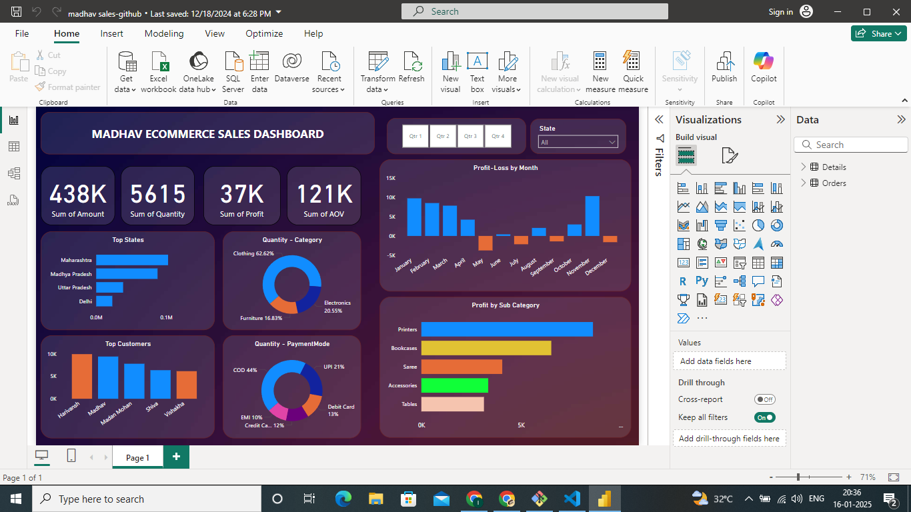

# Sales-ECommerce-Dashboard
My First Power BI Dashboard!
 
 
I created my very first Power BI dashboard by following a YouTube tutorial. It was a great learning experience, and as a hard learner, I’m excited to keep exploring and improving my skills.
 
 
A special thanks to Rishabh Mishra for his guidance and support, which made this possible. His tutorials and insights were incredibly valuable in helping me understand key concepts and techniques in Power BI.
 
 
Through this project, I have learned:
 
How to create data visualizations and insights using Power BI.
 
How to connect and transform data from multiple sources.
 
How to use Power BI's interactive features like filters, slicers, and drill-through options.
 
The importance of storytelling through data and presenting complex information in an accessible way.
 
 
Looking forward to creating more dashboards and refining my skills as I continue my journey with data analysis. 

## Preview

## Dataset
- The dataset used for this project was sourced from a public tutorial.

- ### Dataset Source:
The dataset used for this project was sourced from [YouTube Tutorial by Rishabh Mishra](insert-link-here).
